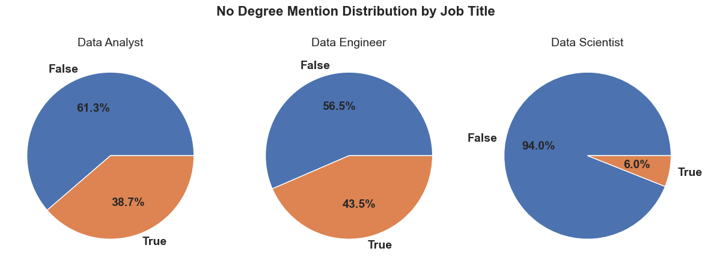
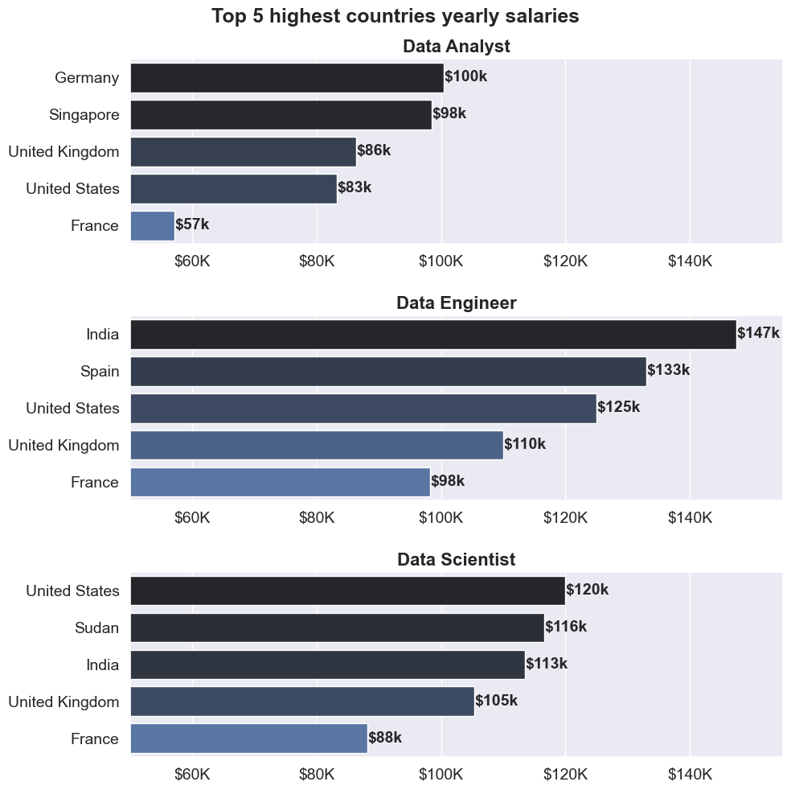
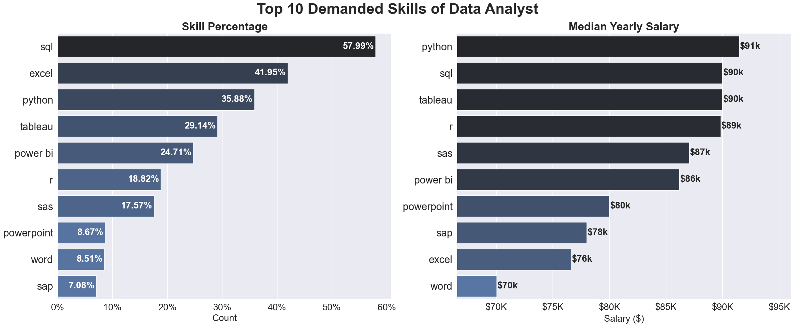
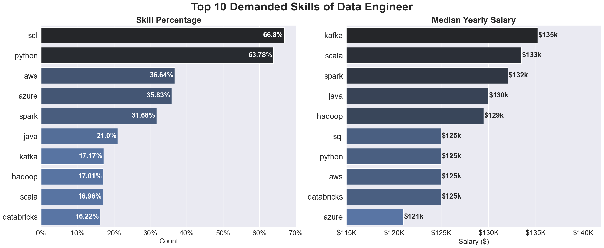
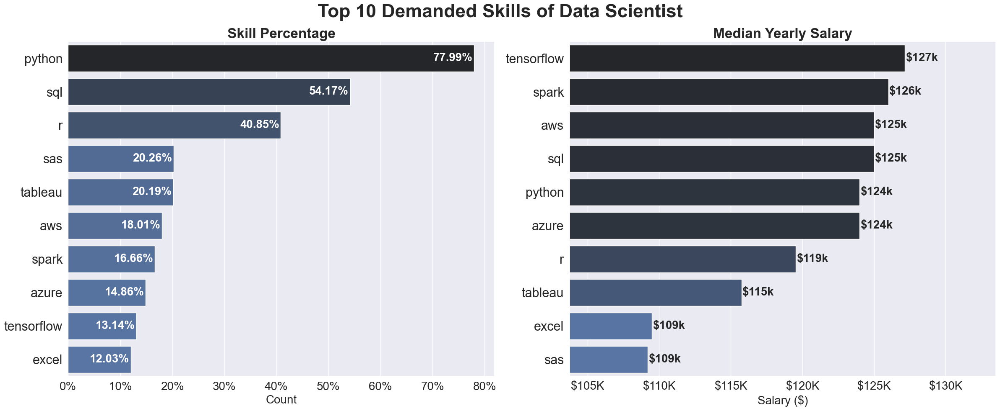

# Data Jobs Market Analysis

This project provides a data-driven analysis of the job market for Data Analysts, Data Engineers, and Data Scientists. The primary goal is to uncover key insights that can guide aspiring data professionals in choosing a career path, focusing on in-demand skills, salary expectations, and geographic opportunities.

---

# 🔑 Key Questions Answered

This analysis explores the `lukebarousse/data_jobs` dataset to answer the following questions:

- What is the best paid job?
- How prevalent are work-from-home opportunities in the data industry?
- Is degree a common requirement for landing a data job?
- Which countries offer the highest salaries for data professionals?
- Which skills are most in-demand for each role, and how do they correlate with median salaries?

---

# 🛠️ Tools I Used

- **Python**: Core programming language.
    - **Pandas**: For data manipulation and analysis.
    - **NumPy**: For numerical operations.
    - **Seaborn & Matplotlib**: For data visualization.
- **Visual Studio Code**: For executing Python scripts
- **Git & GitHub**: For version control and sharing the Python code and Analysis
- **Jupyter Notebooks**: For interactive analysis and reporting.
- **Hugging Face `datasets`**: For loading the dataset.
- **AI Tools**: ChatGPT and Google Gemini

---

# Data Cleanup

```python
import numpy as np
import pandas as pd
import ast
from datasets import load_dataset

# Loading... Data
dataset = load_dataset('lukebarousse/data_jobs')
DF = dataset['train'].to_pandas()

# Cleaning the date column
DF["job_posted_date"] = pd.to_datetime(DF["job_posted_date"])

# Converting jobs skills list from string datatype --> list datatype
DF['job_skills'] = DF['job_skills'].apply(lambda x: ast.literal_eval(x) if type(x)==str else np.nan)


# To Convert (Salary Hour Avg) to (Salary Year Avg)
# hours_per_week = 40
# weeks_per_year = 52

DF['yearly_salary_avg'] = DF['salary_year_avg'].fillna(DF['salary_hour_avg'] * 40 * 52)
```

---

# Explore what the data contains
View my notebook with detaild steps here: [Explore the Data](Explore_the_Data.ipynb)

## What countries does the dataset depend on?


Most of the job postings is from **United States** with more than 200k job posting.

## What jobs does the dataset contains?


**Data Analyst - Data Engineer - Data Scientist** have the biggest number of job postings in the data.

## What is the date of the dataset?


All the data is from **2023**

## What salary rates does the dataset contains?


Most of salary rates is **yearly** in the 1st place and **hourly** in the 2nd palce

All the data is from **2023**

## Notes:
- "Note: Since the majority of data is from the U.S. and 2023, these salary figures may be skewed toward the U.S. market and are representative of a specific time period."
- 95.8% of the data has no valid salary rate

---

# 📊 The Analysis


## What is the most paid job?
View my notebook with detaild steps here
[Salaries](Salaries.ipynb)

### Result


### Insights
- Highest Median Salaries: The roles with the highest median (middle line in the box) salaries appear to be Senior Data Scientist and Senior Data Engineer. They both seem to have a median salary around the $150K mark.

- Seniority Premium: Across the board, the "Senior" versions of the roles (Senior Data Scientist, Senior Data Engineer, Senior Data Analyst) tend to have a higher median salary and a higher upper quartile (top of the box) compared to their non-senior counterparts (Data Scientist, Data Engineer, Data Analyst).

- Lowest Median Salary: Data Analyst has the lowest median salary, appearing to be slightly above the $100K mark.


## 2. How prevalent are work-from-home opportunities in the data industry?
View my notebook with detaild steps here:
[Work from Home](Work_from_Home.ipynb)

### Result


### Insights
- Low Overall Work from Home Prevalence: Across all three data-related job titles, the proportion of roles offering Work from Home is relatively low, with the "True" (Work from Home available) percentage never exceeding 11.4%.

- Data Engineer Roles Offer the Most Work from Home: Data Engineer positions show the highest propensity for work-from-home, with 11.4% of roles having Work from Home flexibility. This contrasts with 88.6% of Data Engineer roles that do not offer Work from Home.

- Data Analyst Roles Offer the Least Work from Home: Data Analyst positions exhibit the lowest Work from Home availability at just 6.8%. The vast majority of Data Analyst roles (93.2%) do not have Work from Home flexibility.

- Data Scientist in the Middle: Data Scientist roles fall between the other two titles, with 8.4% offering Work from Home options and 91.6% not offering it.


## 3. Is degree a common requirement for landing a data job?
View my notebook with detaild steps here:
[No Degree](No_Degree.ipynb)

### Result


### Insights
- Degree Mention Varies Significantly by Role: There is a stark difference in degree requirements (or mention thereof) between the Data Scientist role and the other two roles (Data Analyst and Data Engineer).

- Data Scientist Roles Strongly Require Degrees: Data Scientist positions are overwhelming likely to mention a degree requirement. A massive 94.0% of Data Scientist job postings mention a degree, while only 6.0% do not. This suggests that a degree is a nearly universal prerequisite for this advanced role.

- Data Engineer Most Open to Non-Degree Holders (Relatively): Data Engineer roles are the least likely to explicitly mention a degree requirement, making them relatively more accessible to candidates without a formal degree mentioned in the job post.

- Data Analyst is Balanced, Leaning Towards No Mention: Data Analyst roles fall between the two extremes. The majority of job postings do not mention a degree, but the proportion that does is significant.


## 4. Which countries offer the highest salaries for data professionals?
View my notebook with detaild steps here:
[Top_Countries](Top_Countries.ipynb)

### Result


### Insights
- Geographic Diversity: No single country dominates the top salary position across all three roles, highlighting diverse global market conditions.

- United States' Position: The United States features in the top 5 for all three roles, but only secures the top position for Data Scientist. Its average salary for Data Analyst ($83K) is notably lower than for the other two roles.

- India's High Pay: India demonstrates exceptionally high average salaries for Data Engineer ($147K) and Data Scientist ($113K), challenging traditional assumptions about high-cost locations for these specialized roles.

- France's Consistent Ranking: France consistently ranks fifth across all three job titles, with salaries ranging from $57K (Data Analyst) to $98K (Data Engineer).


## 5. Which skills are most in-demand for each role, and how do they correlate with median salaries?
View my notebook with detaild steps here:
[Skills vs Salaries](Skills_Salaries.ipynb)

### Data Analyst
#### Result


#### Insights
- High Demand for Foundational Skills: The most highly demanded skills for a Data Analyst are SQL (57.99%) and Excel (41.95%). This indicates that foundational data manipulation, querying, and spreadsheet analysis remain essential and are the most frequently required competencies for the role.

- Highest Pay is Associated with Programming/Advanced Tools: While SQL and Excel are the most demanded, the highest median salaries are associated with more advanced programming languages and specialized tools. Python commands the highest median yearly salary at $91K, followed by SQL and Tableau (both at $90K). Notably, Excel is associated with one of the lowest median salaries ($76K) among the top skills, suggesting a premium is paid for roles requiring advanced technical skills over basic spreadsheet proficiency.
---

### Data Engineer
#### Result


#### Insights
- Dominance of Foundational Programming/Querying: SQL (66.8%) and Python (63.78%) are the overwhelmingly most demanded skills for a Data Engineer, with both being required in nearly two-thirds of job postings. This highlights their status as universal prerequisites for data manipulation, scripting, and development in this field.

- Highest Salaries Driven by Real-Time and Advanced Data Processing: While SQL and Python are highly demanded, they are associated with a median salary of $125K. The highest median salaries are commanded by skills related to real-time data streaming and distributed processing: Kafka ($135K), Scala ($133K), and Spark ($132K). This indicates a significant salary premium is paid for Data Engineers specializing in building and managing high-throughput, modern data pipelines and architectures.
---

### Data Scientist
#### Result


#### Insights
- Python is the Overwhelming Core Requirement: Python is the single most demanded skill for a Data Scientist, featured in nearly 78% of job postings (77.99%). This makes Python a near-universal prerequisite, reinforcing its position as the standard language for machine learning, statistical modeling, and general data manipulation in the Data Science field.

- Highest Salaries are Tied to Deep Learning and Cloud Infrastructure: While Python and SQL are highly demanded, the skills associated with the absolute highest median salaries are TensorFlow ($127K) and Spark ($126K). This indicates that a significant salary premium is paid for Data Scientists specializing in advanced applications like deep learning frameworks (TensorFlow) and large-scale distributed computing/big data processing (Spark), which often require advanced technical expertise beyond standard statistical modeling.
---